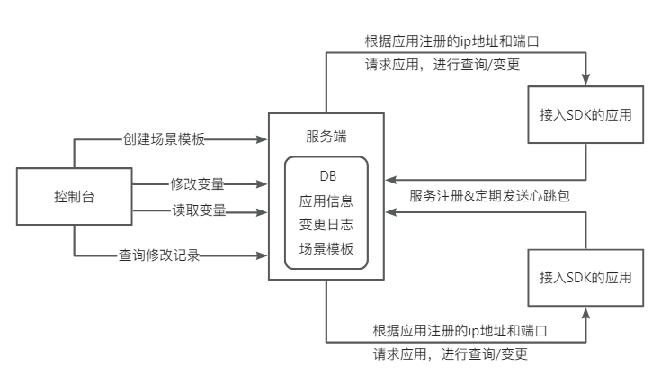

# Master

Master 是一个轻量级的运行时变量管理框架，提供统一的方式来查询和修改应用程序运行时的内存变量，支持多应用接入、场景模板、变更日志等功能。

配套前端控制台：[master-console](https://github.com/Ken-Chy129/master-console)

## 应用场景

- **配置管理**：URL、接口名、超时时间等可能变动的配置项，无需重启即可修改
- **功能开关**：动态开启/关闭缓存、某段代码逻辑的执行
- **运行时控制**：黑白名单、切流百分比等，实时控制程序运行逻辑

## 应用架构



- **控制台**：Web 管理界面，创建场景模板、修改/读取变量、查询变更日志
- **服务端**：存储应用信息、变更日志和场景模板，向接入 SDK 的应用下发变量变更
- **客户端 SDK**：接入应用集成 SDK 后，自动注册并定期发送心跳，接收服务端的变量查询/变更请求

## 项目结构

```
├── master-core/          # 核心模块（通信协议、请求/响应模型、公共枚举）
├── master-client-sdk/    # 客户端 SDK（应用接入、变量注册与管理、Netty 通信）
├── master-server/        # 服务端（Spring Boot + MyBatis，应用管理、变量下发、日志记录）
└── static/               # 静态资源（架构图等）
```

## 技术栈

- Java 17
- Spring Boot 3.0
- MyBatis-Plus
- Netty（服务端与客户端通信）
- MySQL

## 快速开始

1. 创建数据库并导入表结构
2. 修改 `master-server` 中的 `application.yml` 配置数据库连接
3. 启动 `master-server`
4. 业务应用引入 `master-client-sdk` 依赖，使用注解声明需管理的变量
5. 通过 [master-console](https://github.com/Ken-Chy129/master-console) 管理变量
